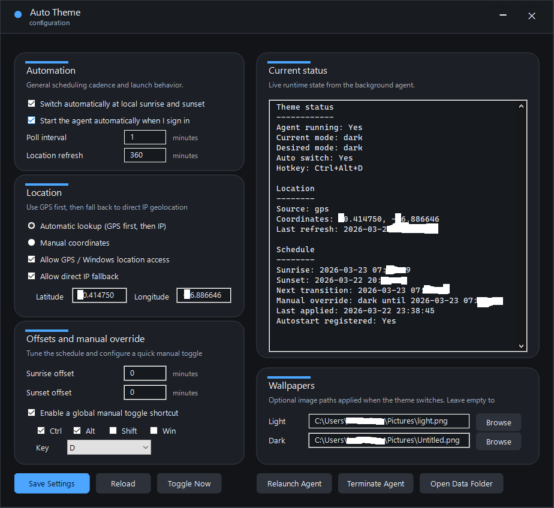

# Auto Theme

Light/dark theme scheduler for Windows 10/11 written in pure WinAPI. 

Automatically switch between system wide dark and light theme based on local sunset/sunrise times, just like on macOS. 

Developed in collaboration with ChatGPT 5.4


## What it includes

- `winxsw-agent.exe`
  - Win32 background process.
  - Starts at user sign-in through `HKCU\Software\Microsoft\Windows\CurrentVersion\Run`.
  - Switches Windows app and system theme values between light and dark.
  - Computes sunrise and sunset locally from latitude and longitude.
  - Uses GPS through the Windows location stack first, then falls back to direct no-proxy IP geolocation.
  - Registers a global hotkey for manual toggling.

- `winxsw-config.exe`
  - Separate native Win32 configuration GUI.
  - Edits `settings.json`.
  - Shows current runtime status from `status.json`.
  - Can save settings, launch the agent, trigger a manual toggle, and open the data folder.


## Solution

- Solution: [winxsw-theme.sln](/C:/Users/kafu-niban/winxsw/winxsw-theme.sln)
- Shared project: [winxsw-shared.vcxproj](/C:/Users/kafu-niban/winxsw/winxsw-shared.vcxproj)
- Agent project: [winxsw-agent.vcxproj](/C:/Users/kafu-niban/winxsw/winxsw-agent.vcxproj)
- Config project: [winxsw-config.vcxproj](/C:/Users/kafu-niban/winxsw/winxsw-config.vcxproj)

## Build

Open the solution in Visual Studio 2026 Insiders or build with MSBuild:

```powershell
& "C:\Program Files\Microsoft Visual Studio\18\Insiders\MSBuild\Current\Bin\MSBuild.exe" `
  "C:\Users\kafu-niban\winxsw\winxsw-theme.sln" `
  /t:Build /p:Configuration=Debug /p:Platform=x64
```

## Data files

The app stores data in `%LOCALAPPDATA%\WinXSwTheme`:

- `settings.json`
- `status.json`

## Default behavior

- Auto-switch enabled.
- Autostart enabled.
- GPS enabled.
- IP fallback enabled.
- Global hotkey: `Ctrl+Alt+D`.
